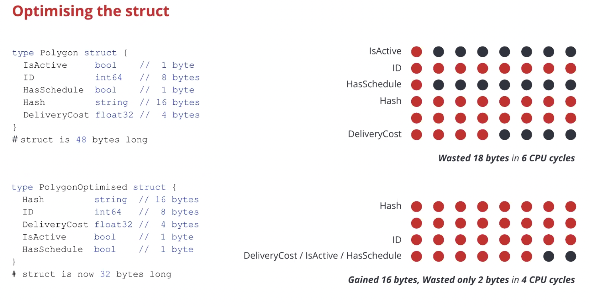

# What's profiling?
how your program use mem and cpu.
>imaging that: what could you do when SRE told you cpu usage too high?


## pprof

[sample code](pprof-optimising-struct/main_test.go)
| this code is from global tech talk: GeoSearch 

1. gen pprof file
```
go test -v -bench=. -memprofile=mem.pprof -cpuprofile=cpu.pprof
```

2. observer cpu usage
```
go tool pprof -http=:5566 cpu.pprof
```

3. observer mem usage
```
go tool pprof -http=:5566 mem.pprof
```

### what happen



## trace
