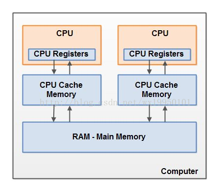
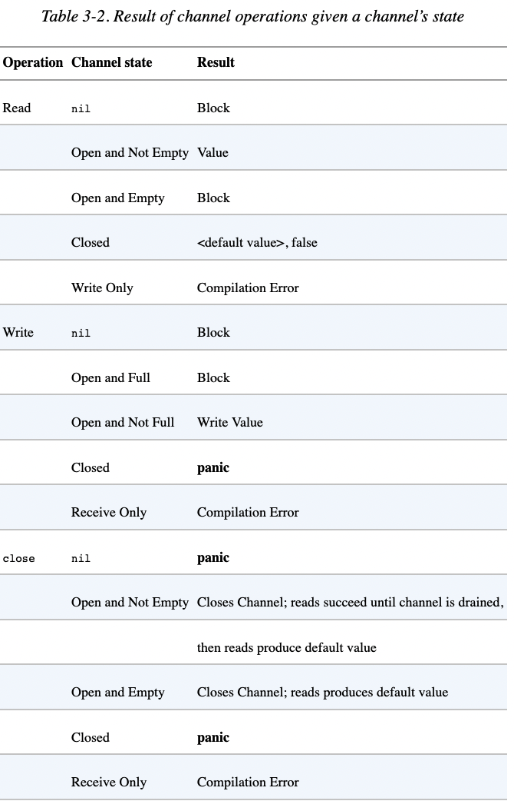

## what is the problem of share resource between goroutines

1. data race
2. race condition

## 1. cause

### 1.1 atomicity  

one line of code will be compiled to multiple instructions, for example `i++` will do the 3 instructions:
```
1. load value from memory
2. add 1 to value
3. restore value back to memory
```

What if 2 goroutines execute `i++`,
we may expect like below:
```
1. goroutine1 load value from memory
2. goroutine1 add 1 to value
3. goroutine1 restore value back to memory
4. goroutine2 load value from memory
5. goroutine2 add 1 to value
6. goroutine2 restore value back to memory
```
and i is correct. But in real world it maybe:
```
1. goroutine1 load value from memory
2. goroutine2 load value from memory
3. goroutine1 add 1 to value
4. goroutine2 add 1 to value
5. goroutine1 restore value back to memory
6. goroutine2 restore value back to memory
```
and i is uncorrect. 
  * [unsafe sample code](atomicity/unsafe_test.go)
  * [safe sample code](atomicity/safe_test.go)

### 1.2 visibility

every core have their own cache, and may be seen by each other.

one cpu may not know other cpu modify value.

  * [unsafe sample code](visibility/unsafe_test.go)
  * [safe sample code](visibility/safe_test.go)

### 1.3 ordering
compiler may reorder instructions:

  * [unsafe sample code](ordering/unsafe_test.go)  
  * [safe sample code](ordering/safe_test.go)  

## problem of lock
1. hard to find problem
1. hard to write test, [sample code](test/lock_hard_to_test.go).
1. performance issue
    1. lock is expensive
    1. can not scale up
    1. starvation

## CSP
  [sample code](test/csp_test.go)

### discussion
imaging goroutine as squard's service
  * imaging share variable as share db
    * every squard's service are couple in share db
    * every change may need lots of connumication
  * imaging channel as SNS/SQS
    * every squard is more independent (develop scalability)
    * every squard can scale up/down base on self's requirment (performance scalability)

#### drawbacks
open question


## reference
[The Go Memory Model](https://go.dev/ref/mem)

## notes


